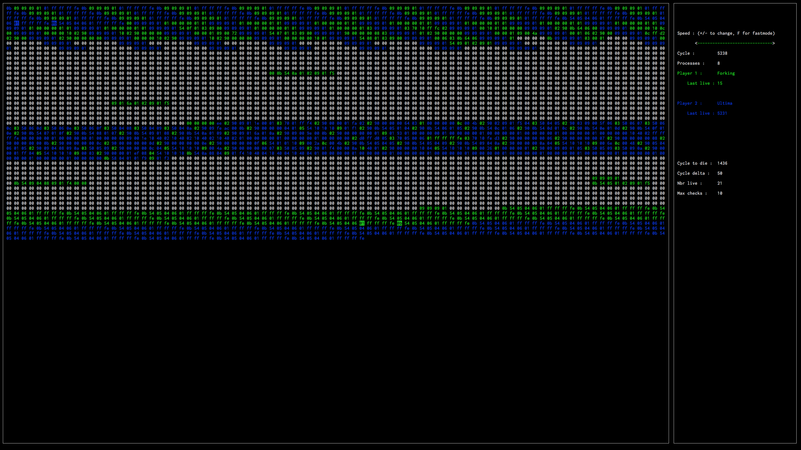

# Corewar
42's version of the famous [programming game](https://en.wikipedia.org/wiki/Core_War).

## What it's about
Programs, known as *champions*, duke it out inside a virtual machine. (Usually known as *MARS*, we call it *the VM*.)
The specifications of this 42 project require:

1. An **assembler**, *asm* for short, which will compile champions ([example](https://gitlab.com/jonasroussel/Corewar/blob/master/champs/our_champs/Forking.s)), written in a variant of Redcode assembly, to bytecode,
2. a **virtual machine**, our arena, wherein our champions (now in bytecode form) hack themselves to bits, and 
3. lastly, a **champion** of our own, to pit against others and win eternal glory.

## How to use
`git clone https://gitlab.com/jonasroussel/Corewar.git && cd Corewar && make && ./asm champs/our_champs/Forking.s champs/fluttershy.s -o output && ./corewar -v output/Forking.cor output/fluttershy.cor`

This will clone the project, compile it, assemble our star champion, *Forking*, and a fellow warrior, before running Corewar in visual mode. Press space, sit back, and watch the bytes fly.

## Visualizer

